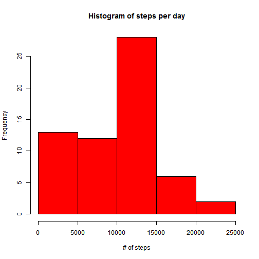
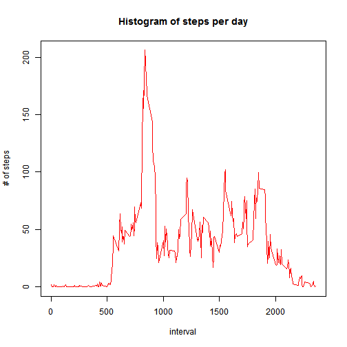
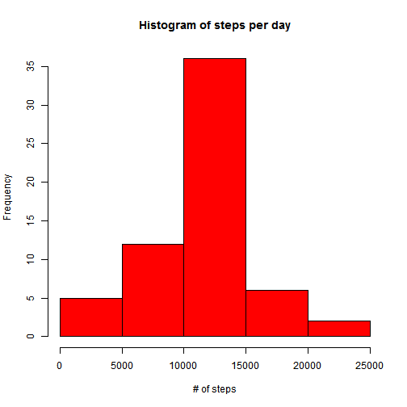
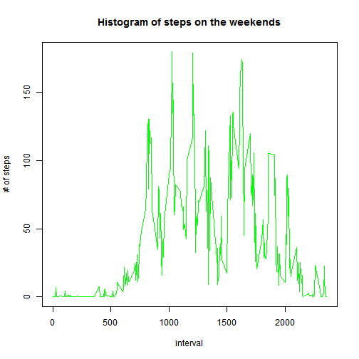
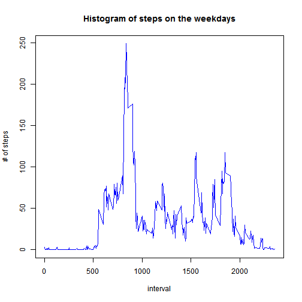

Reproductible Research - Assignment 1
=======================================
 
This is an R Markdown document for the first peer assignment on the Coursera's Reproductible Research Course.

The assignment makes use of data from a personal activity monitoring device. This device collects data at 5 minute intervals through out the day and the data consists of two months of data from an anonymous individual collected during the months of October and November, 2012 and include the number of steps taken in 5 minute intervals each day.

The variables included in this dataset are:

- steps: Number of steps taking in a 5-minute interval (missing values are coded as NA)
- date: The date on which the measurement was taken in YYYY-MM-DD format
- interval: Identifier for the 5-minute interval in which measurement was taken

The dataset is stored in a comma-separated-value (CSV) file and there are a total of 17,568 observations in this dataset.

## Loading and preprocessing the data

Show any code that is needed to:

- Load the data (i.e. read.csv())
- Process/transform the data (if necessary) into a format suitable for your analysis


```r
setwd("C:/Users/Gabriel/Desktop/Projetos R/RepData-Peer1")
data <- read.csv("activity.csv")
head(data)
```

```
##   steps       date interval
## 1    NA 2012-10-01        0
## 2    NA 2012-10-01        5
## 3    NA 2012-10-01       10
## 4    NA 2012-10-01       15
## 5    NA 2012-10-01       20
## 6    NA 2012-10-01       25
```

## What is mean total number of steps taken per day?

For this part of the assignment, you can ignore the missing values in the dataset.

- Make a histogram of the total number of steps taken each day


```r
library(dplyr)
data_days <- summarise(group_by(data, date) , sum(steps,  na.rm = TRUE))
colnames(data_days) <- c("date", "steps")
hist(data_days$steps, xlab = "# of steps", main = "Histogram of steps per day", col = "red")
```

 

- Calculate and report the mean and median total number of steps taken per day


```r
mean(data_days$steps,  na.rm = TRUE)
```

```
## [1] 9354.23
```

```r
median(data_days$steps,  na.rm = TRUE)
```

```
## [1] 10395
```

## What is the average daily activity pattern?

- Make a time series plot (i.e. type = "l") of the 5-minute interval (x-axis) and the average number of steps taken, averaged across all days (y-axis)


```r
data_times <- summarise(group_by(data, interval) , mean(steps,  na.rm = TRUE))
colnames(data_times) <- c("interval", "steps")
plot(data_times$interval, data_times$steps, type = "l", xlab = "interval", ylab = "# of steps", main = "Histogram of steps per day", col = "red")
```

 

- Which 5-minute interval, on average across all the days in the dataset, contains the maximum number of steps?


```r
subset(data_times, steps == max(data_times$steps))
```

```
## Source: local data frame [1 x 2]
## 
##   interval    steps
## 1      835 206.1698
```

## Imputing missing values

Note that there are a number of days/intervals where there are missing values (coded as NA). The presence of missing days may introduce bias into some calculations or summaries of the data.

- Calculate and report the total number of missing values in the dataset (i.e. the total number of rows with NAs)


```r
sum(is.na(data$steps))
```

```
## [1] 2304
```

- Devise a strategy for filling in all of the missing values in the dataset. The strategy does not need to be sophisticated. For example, you could use the mean/median for that day, or the mean for that 5-minute interval, etc.

The strategy is to create a function (Sub_NA) to substitute the all the NA values for 5-minute interval average.


```r
Sub_NA <- function(BASE, BASE_match)
{
        i <- nrow(BASE)
        
        for (k in 1:i)
        {
                if (is.na(BASE[k, 1]))
                {
                        u <- BASE[k, 1]
                        p <- BASE_match[k, 4]
                        BASE[k, 1] <- BASE_match[k, 4]
                        u <- BASE[k, 1]
                }
        }
        
        BASE
}
```

- Create a new dataset that is equal to the original dataset but with the missing data filled in.


```r
data_match <- (merge(data, data_times, by = 'interval'))
data_match <- data_match[order(data_match$date, data_match$interval),]
data <- Sub_NA(data, data_match)
head(data)
```

```
##       steps       date interval
## 1 1.7169811 2012-10-01        0
## 2 0.3396226 2012-10-01        5
## 3 0.1320755 2012-10-01       10
## 4 0.1509434 2012-10-01       15
## 5 0.0754717 2012-10-01       20
## 6 2.0943396 2012-10-01       25
```

- Make a histogram of the total number of steps taken each day and Calculate and report the mean and median total number of steps taken per day.


```r
data_days <- summarise(group_by(data, date) , sum(steps,  na.rm = TRUE))
colnames(data_days) <- c("date", "steps")
hist(data_days$steps, xlab = "# of steps", main = "Histogram of steps per day", col = "red")
```

 


```r
mean(data_days$steps,  na.rm = TRUE)
```

```
## [1] 10766.19
```

```r
median(data_days$steps,  na.rm = TRUE)
```

```
## [1] 10766.19
```

- Do these values differ from the estimates from the first part of the assignment? What is the impact of imputing missing data on the estimates of the total daily number of steps?

Yes, the numbers differ from the ones we did before. It is possible to see an histogram much closer to a normal curve, having a higher center.

## Are there differences in activity patterns between weekdays and weekends?

For this part the weekdays() function may be of some help here. Use the dataset with the filled-in missing values for this part.

- Create a new factor variable in the dataset with two levels -- "weekday" and "weekend" indicating whether a given date is a weekday or weekend day.


```r
Days <- sapply(as.Date(data$date), weekdays)
Days <- gsub("segunda-feira", Days, replacement = "weekday")
Days <- gsub("terça-feira", Days, replacement = "weekday")
Days <- gsub("quarta-feira", Days, replacement = "weekday")
Days <- gsub("quinta-feira", Days, replacement = "weekday")
Days <- gsub("sexta-feira", Days, replacement = "weekday")
Days <- gsub("sábado", Days, replacement = "weekend")
Days <- gsub("domingo", Days, replacement = "weekend")
data <- data.frame(data, Days)
head(data)
```

```
##       steps       date interval    Days
## 1 1.7169811 2012-10-01        0 weekday
## 2 0.3396226 2012-10-01        5 weekday
## 3 0.1320755 2012-10-01       10 weekday
## 4 0.1509434 2012-10-01       15 weekday
## 5 0.0754717 2012-10-01       20 weekday
## 6 2.0943396 2012-10-01       25 weekday
```

- Make a panel plot containing a time series plot (i.e. type = "l") of the 5-minute interval (x-axis) and the average number of steps taken, averaged across all weekday days or weekend days (y-axis).


```r
data_times2 <- summarise(group_by(data, interval, Days) , mean(steps,  na.rm = TRUE))
colnames(data_times2) <- c("interval", "Days", "steps")
data_times3 <- subset(data_times2, Days == "weekend")
plot(data_times3$interval, data_times3$steps, type = "l", xlab = "interval", ylab = "# of steps", main = "Histogram of steps on the weekends", col = "green")
```

 


```r
data_times3 <- subset(data_times2, Days == "weekday")
plot(data_times3$interval, data_times3$steps, type = "l", xlab = "interval", ylab = "# of steps", main = "Histogram of steps on the weekdays", col = "blue")
```

 
